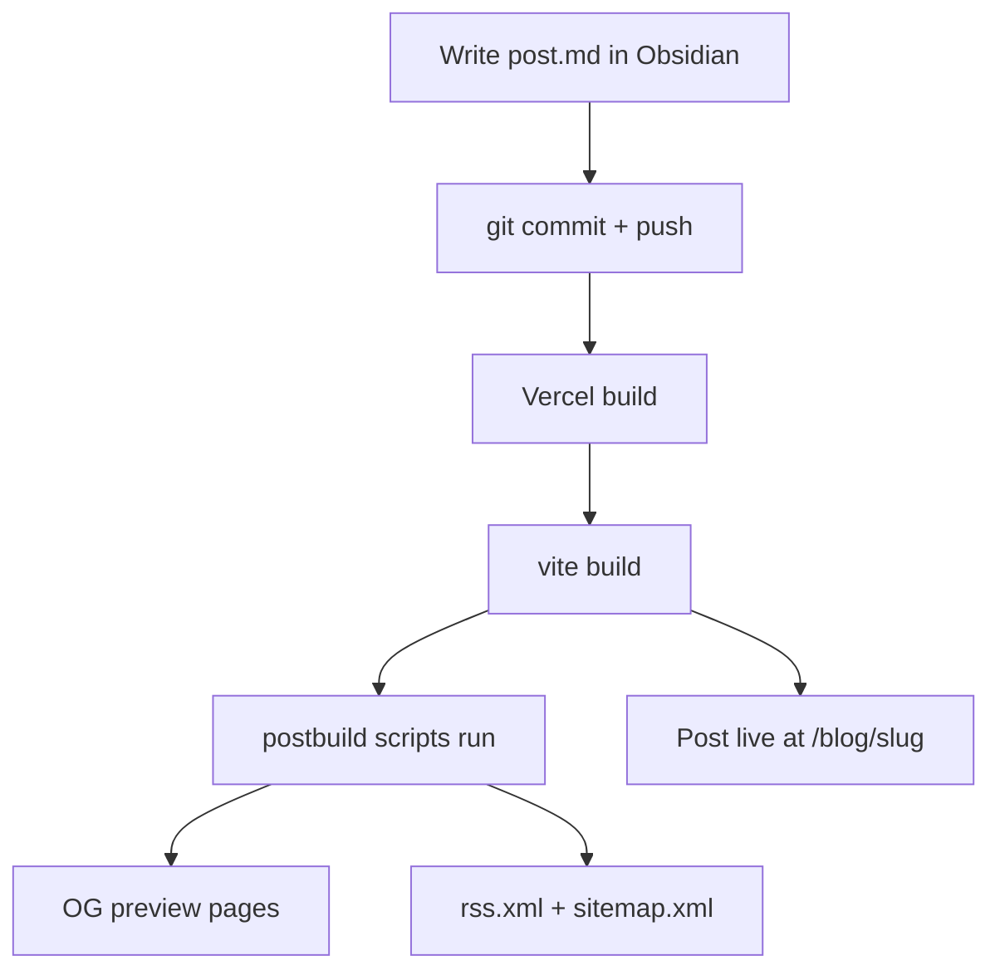

This blog has exactly one moving part: markdown files in a folder.

## The pipeline

1. Write a post as a `.md` file in `src/content/blog/`, with a small
   frontmatter block at the top (title, date, excerpt, tags).
2. Commit it and push to GitHub.
3. Vercel picks up the push, rebuilds the site, and the post is live at
   `/blog/<the-filename-without-.md>` — no extra step, no manual publish
   button.

That's it. There's no database, no admin panel, and nothing that can go
down except GitHub and Vercel, which is exactly the point.



Every box after "Vercel build" happens automatically — nothing to run by hand.

## Writing in Obsidian

The `src/content/blog` folder can be opened directly as an Obsidian
vault — Obsidian just edits the files in place, and Obsidian's native
frontmatter support (the Properties panel) matches this blog's
frontmatter format exactly. Write the post, save, then commit + push
from whatever git tool is comfortable (VS Code, GitHub Desktop, or the
terminal).

## What "frontmatter" means here

Every post starts with a block like this:

```yaml
---
title: "My Post Title"
date: 2026-08-05
excerpt: "One or two sentences for the blog list card."
tags: [ai, engineering]
published: true
---
```

Set `published: false` on any post to keep it off the live site while
it's still a draft — it'll sit in the repo invisibly until that's
flipped back to `true` (or removed, since posts publish by default).

Everything below the closing `---` is just normal markdown: headings,
lists, code blocks, links, images, tables — all of it renders.
