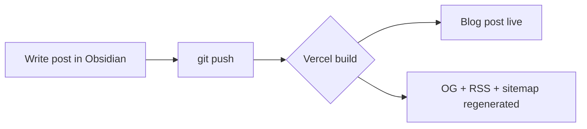

This post exists purely to show what renders correctly. Delete it
whenever — it's not meant to stick around.

## Headings, text, and emphasis

**Bold text**, _italic text_, and `inline code` all render as expected.
Regular paragraphs wrap normally and can be as long as they need to be.

## Lists

Unordered:

- First point
- Second point
- Third point

Ordered:

1. Write the post
2. Push to GitHub
3. Done

## Code blocks — any language, with a copy button

Every fenced code block gets a header showing its language and a
one-click copy button, no matter which language you use:

```js
function greet(name) {
  return `Hello, ${name}!`;
}

console.log(greet("world"));
```

```python
def greet(name: str) -> str:
    return f"Hello, {name}!"

print(greet("world"))
```

```bash
# works for shell snippets too
npm install
npm run dev
```

## A mermaid diagram

Fenced blocks tagged ```` ```mermaid ```` render as an actual diagram —
same as Notion or Obsidian's preview mode — while still keeping the
language badge and copy button (it copies the mermaid source, not the
picture):



## Math equations

Inline math like $E = mc^2$ or $a^2 + b^2 = c^2$ flows right in the
middle of a sentence, using single dollar signs.

Block equations get their own centered line — use double dollar signs:

$$
\int_0^\infty e^{-x^2} \, dx = \frac{\sqrt{\pi}}{2}
$$

They can be as involved as you need:

$$
\begin{aligned}
\nabla \times \vec{B} - \frac{1}{c}\frac{\partial\vec{E}}{\partial t} &= \frac{4\pi}{c}\vec{J} \\
\nabla \cdot \vec{E} &= 4\pi\rho
\end{aligned}
$$

## Function graphs

Equations show the symbols; sometimes you want the actual picture.
A fenced ` ```plot ` block renders as a real graph instead of text —
here's sine and cosine over one full period:

```plot
{
  "xAxis": { "domain": [-6.5, 6.5] },
  "yAxis": { "domain": [-2, 2] },
  "grid": true,
  "data": [
    { "fn": "sin(x)" },
    { "fn": "cos(x)" }
  ]
}
```

It's not just for plotting curves — `function-plot` can compute and
draw a derivative too. Move your mouse over this graph and watch the
tangent line track the curve at $f(x) = x^2$:

```plot
{
  "xAxis": { "domain": [-4, 4] },
  "yAxis": { "domain": [-2, 8] },
  "grid": true,
  "data": [
    {
      "fn": "x^2",
      "derivative": { "fn": "2x", "updateOnMouseMove": true }
    }
  ]
}
```

## A blockquote

> Good writing is clear thinking made visible.

## A table

| Feature          | Supported |
|------------------|-----------|
| Headings         | Yes       |
| Code blocks      | Yes       |
| Copy button      | Yes       |
| Tables           | Yes       |
| Images           | Yes       |
| Cover image      | Yes       |

## A link

[This links back to the homepage](/) — regular markdown links work fine
inside post bodies.

## About that cover image

This post's frontmatter sets `coverImage: /assets/images/profile.png` —
an absolute path to a file already in `public/assets/images/`, which is
why it shows up both here and as the thumbnail on the blog list and
homepage cards. For a post you write in Obsidian, drop the image into
`src/content/blog/images/` instead and reference it as
`coverImage: images/my-cover.png` (relative, no leading slash) — the
build resolves that automatically to the right file.
