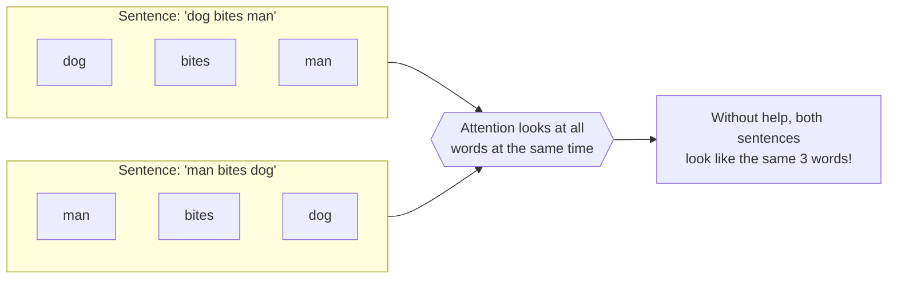
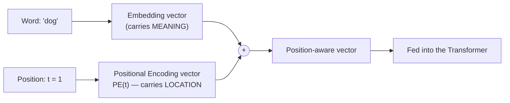
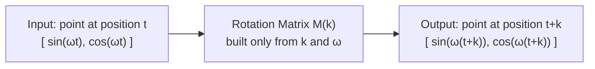
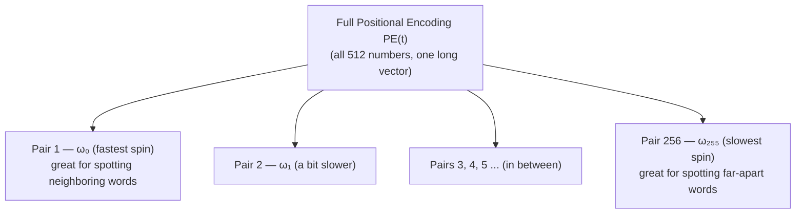

Imagine you get a text message that just says:

> "man bites dog"

You'd be alarmed. Now imagine it said:

> "dog bites man"

Completely different story — same three words, different order. Order carries meaning.

Now here's the strange part. The most powerful AI architecture we have today, called the **Transformer**, has a weird blind spot: on its own, it cannot tell these two sentences apart. It looks at every word in a sentence **at the same exact instant**, like glancing at a pile of scrabble tiles all at once, instead of reading left to right like you do.

This post explains, from the very beginning, how engineers fixed this blind spot using something called **Positional Encoding** — and the beautiful piece of math (a rotation, like turning a clock hand) that makes it work. We will not skip a single term. Every new word gets defined the moment it shows up.

By the end, you'll understand not just *what* positional encoding is, but *why* it's built out of sine waves specifically, and *how* a simple rotation lets the model figure out "these two words are exactly 3 words apart" no matter where in the sentence they are.

## The problem: a Transformer sees a pile, not a line

Let's define two words before anything else.

**Token**: a small chunk of text — usually a word or part of a word — that the model treats as one unit. "Transformers" might become the tokens `Transform` + `ers`. For our purposes, just think of a token as "one word."

**Transformer**: a type of AI model (the "T" in ChatGPT — Chat**G**enerative **P**re-trained **T**ransformer) that reads a whole sentence and, for every word, asks "which other words in this sentence matter to me, and how much?" That asking-and-weighing step is called **Attention**, and we'll come back to it. The important thing right now is *how* attention looks at the sentence: it looks at every token **simultaneously**, not one after another.

Compare that to you reading this sentence. Your eyes move left to right. You always know "man" came before "bites" because you read it in that order. A Transformer has no such luck — it's handed all the words in one shot, like a hand of cards dealt face-up on a table at once.



That's the problem in one picture. If we did nothing else, "dog bites man" and "man bites dog" would look identical to the model, because it's the exact same three words — just seen as an unordered pile instead of an ordered line.

> **Key insight:** A Transformer needs someone to tape a little label onto each word saying "I am word number 1," "I am word number 2," and so on — otherwise it truly cannot tell order apart from chaos.

That label is called a **Positional Encoding**, and figuring out exactly what to write on that label — and how the model can *use* it — is the entire subject of this post.

## Meet the vector: how AI actually "sees" a word

Before we can label a word's position, we need to understand what a word looks like *inside* the model. It isn't text anymore — it's numbers.

**Vector**: just a list of numbers, like `[0.2, -1.5, 0.9]`. That's it — no magic. You can picture a short vector (say, 2 numbers) as an arrow on a graph: the first number tells you how far to go sideways, the second number tells you how far to go up or down. A long vector (say, 512 numbers) is the exact same idea, just an arrow pointing through a space with 512 directions instead of 2 — impossible to draw, but the math works exactly the same way.

**Embedding**: the vector that represents a word's *meaning*. Words with similar meanings get vectors that point in similar directions. "Happy" and "joyful" would have embedding vectors close together; "happy" and "bicycle" would point in very different directions. The model learns these vectors during training — nobody hand-writes them.

So right now, every word in a sentence is just a vector floating in space, carrying meaning but **carrying zero information about where it sat in the sentence**. Two identical words ("bites" and "bites") get the identical embedding vector, whether they were word #2 or word #47.

We need to *add* something to that vector — a second vector, whose entire job is to say "and by the way, I was at position `t`." That second vector is the positional encoding, written **PE(t)**, where `t` is just the word's position: word 1 has `t = 1`, word 2 has `t = 2`, and so on.



Simple addition. The question that takes up the rest of this post is: **what numbers should go inside PE(t)?**

## Building block: sine, cosine, and the clock hand

The designers of the Transformer (in a 2017 paper called "Attention Is All You Need") picked something surprising for PE(t): waves. Specifically, **sine** and **cosine**. Let's build these up from nothing.

**Angle**: a measurement of how much something has turned, like the hands of a clock. We usually measure angles in degrees (a full turn is 360°), but math prefers a different unit called a **radian**, where a full turn is about 6.28 (written as $2\pi$). You don't need to memorize this — just know "radians" is simply another ruler for measuring rotation, like using centimeters instead of inches.

**Unit circle**: picture a circle with a radius of exactly 1, centered on a graph. Now imagine a clock hand of length 1 sitting at the center, able to point in any direction.

**Cosine ($\cos$)** and **Sine ($\sin$)**: as that clock hand sweeps around the circle by some angle, cosine tells you how far right/left the tip of the hand is (its horizontal position), and sine tells you how far up/down it is (its vertical position). At angle 0 (pointing right), $\cos(0) = 1$ and $\sin(0) = 0$. As the hand sweeps counter-clockwise, both numbers rise and fall smoothly between $-1$ and $1$, forever, tracing out the two wave shapes below:

```plot
{
  "title": "sin(x) and cos(x) — the two waves behind positional encoding",
  "xAxis": { "domain": [0, 12.6] },
  "yAxis": { "domain": [-1.5, 1.5] },
  "grid": true,
  "data": [
    { "fn": "sin(x)" },
    { "fn": "cos(x)" }
  ]
}
```

And here is the actual path the tip of that clock hand draws as it turns — the unit circle itself, built purely from those two waves used together as an (x, y) coordinate:

```plot
{
  "title": "The unit circle: the point (cos t, sin t) as t sweeps around",
  "xAxis": { "domain": [-1.5, 1.5] },
  "yAxis": { "domain": [-1.5, 1.5] },
  "grid": true,
  "data": [
    { "x": "cos(t)", "y": "sin(t)", "fnType": "parametric", "graphType": "polyline", "range": [0, 6.2832] }
  ]
}
```

Why does this matter for word positions? Because sine and cosine give us something extremely useful: **a value that changes smoothly and predictably as `t` grows, but never explodes to a huge number.** If we'd just used `t` itself (1, 2, 3, 4...) as the positional signal, sentence position 5000 would produce a gigantic number that would throw off the whole network. Waves solve that — they stay gently bounded between $-1$ and $1$ forever, no matter how long the sentence gets.

## Assembling the formula: PE(t) = a point on the circle

Here is the actual definition, for one pair of numbers inside the positional encoding vector:

$$
PE(t) = \begin{bmatrix} \sin(\omega t) \\ \cos(\omega t) \end{bmatrix}
$$

Let's unpack every symbol.

- $t$ — the position of the word (1, 2, 3, ...). We called this "word step" earlier.
- $\omega$ (the Greek letter *omega*) — **frequency**: a fixed number that controls *how fast* the clock hand spins as `t` increases by 1. We'll define its exact value in a moment.
- $\sin(\omega t)$ and $\cos(\omega t)$ — multiplying $\omega$ by $t$ first converts "word step count" into "an angle," because $\sin$ and $\cos$ only know how to operate on angles, not on raw counts like "word number 7." Multiplying by $\omega$ is the conversion factor, exactly like multiplying kilometers by a conversion factor to get miles.

So for a single frequency $\omega$, every word position `t` lands on a unique point on the unit circle. Word 1 lands somewhere, word 2 lands a little further around the circle, word 3 a little further still — like a second-hand ticking around a clock face, one tick per word.

**Frequency ($\omega$)**: how big each tick is. A *high* frequency means a big jump around the circle for every single word — good for telling apart words that are right next to each other, but it loops back to the start quickly (like a second hand — it repeats every 60 seconds). A *low* frequency means a tiny jump per word — bad for nearby words (barely moves), but great for far-apart words, because it takes hundreds of words before it loops back and starts repeating itself (like an hour hand).

```plot
{
  "title": "High frequency (fast spin) vs low frequency (slow spin)",
  "xAxis": { "domain": [0, 40] },
  "yAxis": { "domain": [-1.5, 1.5] },
  "grid": true,
  "data": [
    { "fn": "sin(x)" },
    { "fn": "sin(0.08*x)" }
  ]
}
```

Look at the two curves above. The fast one finishes a full up-and-down cycle in about 6 words, then repeats — so word 6 and word 12 land on almost the same spot, which is confusing if you're trying to measure "how far apart" two words that are hundreds of positions away. The slow one barely moves at all across 40 words — perfect for spotting long-distance relationships, useless for spotting the difference between neighboring words.

This is exactly why real positional encodings don't use just *one* frequency — they use **dozens of pairs of dimensions, each with its own frequency**, some fast and some slow, so the model has both a "second hand" and an "hour hand" (and everything in between) available at once. The actual formula used in the original Transformer paper for the $m$-th pair of dimensions is:

$$
\omega_m = \frac{1}{10000^{\frac{2m}{d_{\text{model}}}}}
$$

Don't worry about memorizing this — the only thing to internalize is: **$m = 0$ gives the fastest-spinning pair, and as $m$ grows, $\omega_m$ shrinks toward zero, giving slower and slower spins.** $d_{\text{model}}$ is just the total length of the embedding vector (a typical value is 512, meaning 256 frequency pairs, each contributing 2 numbers: one sine, one cosine).

> **Wavelength**, quickly: if frequency is "how big a jump per word," wavelength is "how many words until the wave repeats itself" — the two are opposites. A tiny frequency means a huge wavelength (it takes a very long sentence to loop back), and a huge frequency means a tiny wavelength (loops back almost immediately).

## The real question: what happens when we shift?

Here's the goal that makes this whole design worthwhile, and it's the actual subject of the [original article this post is based on](https://blog.timodenk.com/linear-relationships-in-the-transformers-positional-encoding/): we want the model to easily learn things like *"these two words are exactly 3 positions apart,"* no matter **where** in the sentence that gap happens to be. Word 1 and word 4 are 3 apart. Word 100 and word 103 are also 3 apart. We want the model to recognize "3 apart" as the *same kind of relationship* in both cases, without having to separately memorize every possible pair of positions in every possible sentence.

In math terms: we want a way to go from $PE(t)$ to $PE(t+k)$ — where $k$ is the shift distance (say, $k=3$) — using an operation that depends **only on $k$**, never on the starting point $t$. If we can do that, the model can learn "what a 3-word gap looks like" *once*, and it will automatically work everywhere in every sentence.

> **Quick check before we continue:** if you just *added* a fixed vector to shift positions (like $PE(t+k) = PE(t) + \text{something}(k)$), would that work with sine and cosine? Try sketching it — sine and cosine don't add in straight lines, they curve. Addition alone can't produce another point *exactly on the same circle*. We need something else: a way to slide a point **around** the circle, keeping it on the circle. That "something else" is called a **rotation**, and it's applied with **multiplication**, not addition.

## The rotation trick, derived step by step

Let's prove that shifting position by $k$ is *exactly* the same as rotating our point around the circle by a fixed angle. We'll build this from the ground up using nothing but high-school trigonometry.

### Step 1 — write down the two points

The vector at position $t$, using one frequency $\omega$:

$$
PE(t) = \begin{bmatrix} \sin(\omega t) \\ \cos(\omega t) \end{bmatrix}
$$

The vector we *want* to reach, at position $t + k$:

$$
PE(t+k) = \begin{bmatrix} \sin(\omega (t+k)) \\ \cos(\omega (t+k)) \end{bmatrix} = \begin{bmatrix} \sin(\omega t + \omega k) \\ \cos(\omega t + \omega k) \end{bmatrix}
$$

All we did there was multiply $\omega$ through the parentheses: $\omega(t+k) = \omega t + \omega k$. Ordinary algebra, nothing fancy yet.

### Step 2 — split the angle using the angle-addition rule

Trigonometry has two classic rules for splitting the sine or cosine of an added angle into pieces — you may have seen these in high school and forgotten them, which is fine, here they are again:

$$
\sin(\alpha+\beta) = \sin\alpha\cos\beta + \cos\alpha\sin\beta
$$

$$
\cos(\alpha+\beta) = \cos\alpha\cos\beta - \sin\alpha\sin\beta
$$

These simply describe: "if you combine two angles, here's how to compute the sine or cosine of the result using only the sines and cosines of the two original angles separately." We don't need to prove *why* this identity is true (it comes from basic circle geometry) — we only need to *use* it as a known tool, the same way you'd use a wrench without re-deriving how wrenches work.

Set $\alpha = \omega t$ (our starting angle) and $\beta = \omega k$ (the shift angle). Plugging into both rules:

$$
\sin(\omega t + \omega k) = \sin(\omega t)\cos(\omega k) + \cos(\omega t)\sin(\omega k)
$$

$$
\cos(\omega t + \omega k) = \cos(\omega t)\cos(\omega k) - \sin(\omega t)\sin(\omega k)
$$

### Step 3 — notice this is just a weighted mix of the old values

Look closely at the right-hand sides. Both are just $\sin(\omega t)$ and $\cos(\omega t)$ (the two numbers we already have) multiplied by some fixed numbers ($\cos(\omega k)$ and $\sin(\omega k)$, which only depend on $k$) and added together. That "multiply-and-add" pattern has a name: it's called a **linear combination**, and there's a standard, compact way to write a pair of linear combinations like this — as a **matrix** multiplying a vector.

**Matrix**: think of a matrix as a small machine with slots for numbers. You feed it a vector (a point), and it spits out a new vector (a new point), using a fixed recipe. A $2\times2$ matrix (2 rows, 2 columns of numbers) takes in a 2-number vector and produces a 2-number vector, following this exact rule:

$$
\begin{bmatrix} W & X \\ Y & Z \end{bmatrix} \begin{bmatrix} A \\ B \end{bmatrix} = \begin{bmatrix} W \!\cdot\! A + X \!\cdot\! B \\ Y \!\cdot\! A + Z \!\cdot\! B \end{bmatrix}
$$

Compare that recipe to our two equations from Step 2. They match perfectly if we build the matrix like this:

$$
\begin{bmatrix} \cos(\omega k) & \sin(\omega k) \\ -\sin(\omega k) & \cos(\omega k) \end{bmatrix} \begin{bmatrix} \sin(\omega t) \\ \cos(\omega t) \end{bmatrix} = \begin{bmatrix} \sin(\omega (t+k)) \\ \cos(\omega (t+k)) \end{bmatrix}
$$

We'll call that matrix $M(k)$ — our "shifting machine."



### Step 4 — why this is the whole point

$$
M(k) = \begin{bmatrix} \cos(\omega k) & \sin(\omega k) \\ -\sin(\omega k) & \cos(\omega k) \end{bmatrix}
$$

Stare at what variables appear inside $M(k)$: only $k$ (the shift distance) and $\omega$ (a fixed frequency chosen ahead of time). **The starting position $t$ has completely disappeared.** It got absorbed and canceled out by the trigonometric identity in Step 2.

This means: whether you're shifting from word 1 to word 4, or from word 100 to word 103, or from word 9,997 to word 10,000 — as long as the *gap* is $k = 3$, you multiply by the **exact same matrix** $M(3)$. That is the entire mathematical magic trick this post has been building toward: **relative position ("3 words apart") becomes a single, reusable, fixed operation, completely independent of absolute position.**

This kind of "fixed machine that transforms one vector into another using multiplication" is called a **linear transformation**, and a matrix that performs a pure rotation (spins a point around a circle without stretching or flipping it) is called a **rotation matrix**. That's exactly what $M(k)$ is — a rotation matrix, spinning the point by an angle of $\omega k$.

### Sanity check: shifting by zero

What should happen if $k = 0$ (no shift at all)? Let's plug it in. Since $\omega \cdot 0 = 0$, and we know $\cos(0) = 1$ and $\sin(0) = 0$:

$$
M(0) = \begin{bmatrix} \cos(0) & \sin(0) \\ -\sin(0) & \cos(0) \end{bmatrix} = \begin{bmatrix} 1 & 0 \\ 0 & 1 \end{bmatrix}
$$

A matrix with 1s down the diagonal and 0s everywhere else is called the **identity matrix** — the "do nothing" machine. Multiply any point by it, and you get that exact same point back, untouched. That's exactly what we'd hope for: shifting by 0 positions should change nothing, and the math agrees.

## Scaling up: many circles at once

So far we've only handled **one** pair of numbers (one frequency $\omega$, giving us sine and cosine — 2 numbers total). Real positional encodings are much longer vectors — $d_{\text{model}} = 512$ is typical. The trick is almost embarrassingly simple: **just repeat the whole 2-number recipe over and over, once per frequency, and glue the results together into one long vector.**

Pair 1 uses the fastest frequency $\omega_0$. Pair 2 uses a slightly slower $\omega_1$. And so on, down to the slowest pair. Each pair spins around its *own, independent* circle, completely unaware of the others.



Because every pair is independent, the big shifting matrix for the *whole* vector is just all these small $2\times2$ rotation matrices lined up diagonally, each one spinning its own pair by its own angle $\omega_m k$, with zeros everywhere else. Mathematicians call this a **block-diagonal matrix** — a big matrix made of small, independent matrices sitting along its diagonal, each minding its own business. The same conclusion from before still holds at full scale: this giant shifting matrix depends only on $k$, never on $t$.

## Why the model actually cares about any of this

Inside a Transformer, when the model checks "how related are word A and word B," it does something close to a **dot product** — multiplying matching numbers from two vectors together and adding up the results, a common way to measure "how aligned two arrows are." Because the positional encodings are built from sine/cosine pairs that shift *linearly* (via that clean rotation matrix, with no leftover dependence on absolute position), the model's job of learning "these two words are 3 apart" becomes something it can pick up as one reusable pattern, instead of needing to separately memorize the pair (1, 4), the pair (2, 5), the pair (100, 103), and every other pair with a 3-word gap, one at a time. That reusability is precisely why the original paper chose *this* wave-based design instead of something simpler like just writing the raw number `t` into the vector.

## Proof by code

Words and diagrams are convincing, but let's just check the math actually works, with real numbers. Here's a tiny Python demo building a 4-number positional encoding (2 frequency pairs), then verifying that multiplying by the shift matrix $M(k)$ really does land exactly on $PE(t+k)$:

```python
import numpy as np

def positional_encoding(t, d_model):
    """Sinusoidal positional encoding vector for a single position t."""
    vec = np.zeros(d_model)
    for i in range(0, d_model, 2):
        m = i / 2
        omega = 1.0 / (10000 ** (2 * m / d_model))
        vec[i]     = np.sin(omega * t)
        vec[i + 1] = np.cos(omega * t)
    return vec

def rotation_matrix(k, d_model):
    """Block-diagonal matrix: one 2x2 rotation per frequency pair."""
    M = np.zeros((d_model, d_model))
    for i in range(0, d_model, 2):
        m = i / 2
        omega = 1.0 / (10000 ** (2 * m / d_model))
        c, s = np.cos(omega * k), np.sin(omega * k)
        M[i, i], M[i, i + 1]     = c, s
        M[i + 1, i], M[i + 1, i + 1] = -s, c
    return M

d_model, t, k = 4, 5, 3

pe_t  = positional_encoding(t, d_model)
pe_tk = positional_encoding(t + k, d_model)
predicted = rotation_matrix(k, d_model) @ pe_t

print("PE(t)        =", np.round(pe_t, 4))
print("PE(t+k)      =", np.round(pe_tk, 4))
print("M(k) @ PE(t) =", np.round(predicted, 4))
print("They match:", np.allclose(pe_tk, predicted))
```

Running this prints:

```text
PE(t)        = [-0.9589  0.2837  0.05    0.9988]
PE(t+k)      = [ 0.9894 -0.1455  0.0799  0.9968]
M(k) @ PE(t) = [ 0.9894 -0.1455  0.0799  0.9968]
They match: True
```

`M(k) @ PE(t)` lands on exactly the same numbers as directly computing `PE(t+k)` — the derivation from the previous section isn't just theoretical, it's numerically exact.

## The sequel: RoPE (Rotary Position Embedding)

Modern large language models (LLaMA and many others) took this exact rotation idea and pushed it one step further, called **RoPE (Rotary Position Embedding)**. The core difference:

| Feature | Classic Sinusoidal PE (this post) | RoPE |
|---|---|---|
| Where it's applied | Added to word vectors once, at the very input | Applied directly to the Query and Key vectors, *inside* the attention step |
| How it combines | **Addition**: word vector + position vector | **Rotation**: the vector itself gets spun by a position angle |
| Relative distance | Present, but has to be *discovered* mathematically (exactly what we proved above) | Built in *directly* — comparing two rotated vectors automatically leaves only their angle difference |

The intuition carries over exactly: **give every position an angle on a circle, and let the model compare angle differences instead of raw positions.** If word A sits at 30° and word B sits at 90°, their difference is 60°. Shift both words 10 steps further into the sentence, and the angle difference is *still* 60° — the starting point cancels out, just like it canceled out of our matrix $M(k)$ above. RoPE simply moves this same rotation trick to happen later, right when the model is comparing two words to each other, instead of once at the very start.

## The big idea, in one sentence

A Transformer glues a sine/cosine "fingerprint" onto every word position, using many frequencies at once (some fast, some slow), specifically because that fingerprint can be slid forward or backward by any fixed distance $k$ using nothing but a rotation — and that rotation depends only on the *distance* between two words, never on *where* those words happen to sit in the sentence.

## Glossary — every term from this post, in one place

| Term | Plain-language meaning |
|---|---|
| Token | A chunk of text (usually close to a word) the model treats as one unit. |
| Transformer | An AI architecture that looks at every token in a sentence at once and figures out which ones matter to each other. |
| Attention | The mechanism inside a Transformer that scores "how related is this word to that word." |
| Vector | A list of numbers; can be pictured as an arrow pointing through space. |
| Embedding | A vector representing a word's *meaning* (similar words → similar vectors). |
| Positional Encoding (PE) | A vector representing a word's *position*, added on top of its embedding. |
| Radian | A unit for measuring angles/rotation (a full circle ≈ 6.28 radians). |
| Sine / Cosine | Functions that track the vertical / horizontal position of a point spinning around a circle of radius 1. |
| Frequency (ω) | How big a jump around the circle happens per word step; high = fast spin, low = slow spin. |
| Wavelength | How many word steps it takes to complete one full loop of the circle; the inverse of frequency. |
| Matrix | A fixed "machine" that transforms one vector into another via a set recipe of multiply-and-add. |
| Linear combination | A value built by multiplying inputs by fixed numbers and adding the results. |
| Linear transformation | An operation on a vector (like a matrix multiply) that follows the linear-combination rule. |
| Rotation matrix | A matrix that spins a point around a circle without stretching it. |
| Identity matrix | The "do nothing" matrix — multiplying by it returns the same vector unchanged. |
| Block-diagonal matrix | A big matrix made of several small, independent matrices placed along its diagonal. |
| Dot product | Multiplying matching numbers from two vectors and summing the results — a measure of alignment. |
| RoPE | Rotary Position Embedding — a modern method that rotates Query/Key vectors inside attention instead of adding a position vector at the input. |

## Further reading

This post builds on and re-derives the argument from Tim Denk's original write-up, [*Linear Relationships in the Transformer's Positional Encoding*](https://blog.timodenk.com/linear-relationships-in-the-transformers-positional-encoding/), which is worth reading directly for the fully general, multi-dimensional version of the proof above. The positional encoding formula itself comes from the 2017 paper *Attention Is All You Need* (Vaswani et al.), the paper that introduced the Transformer architecture in the first place.
